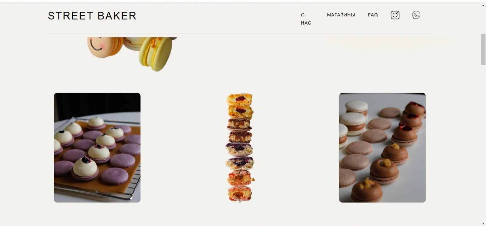
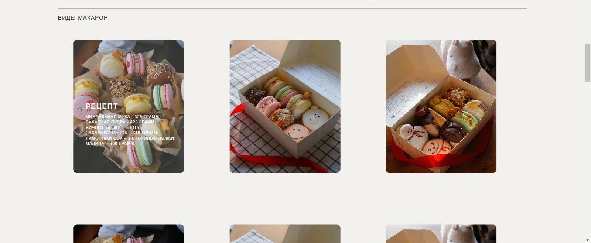
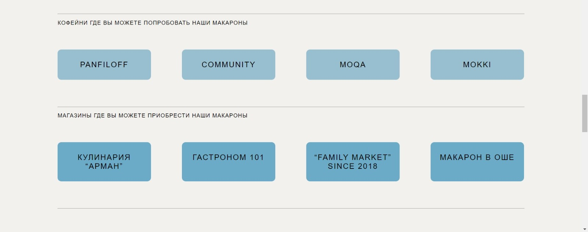
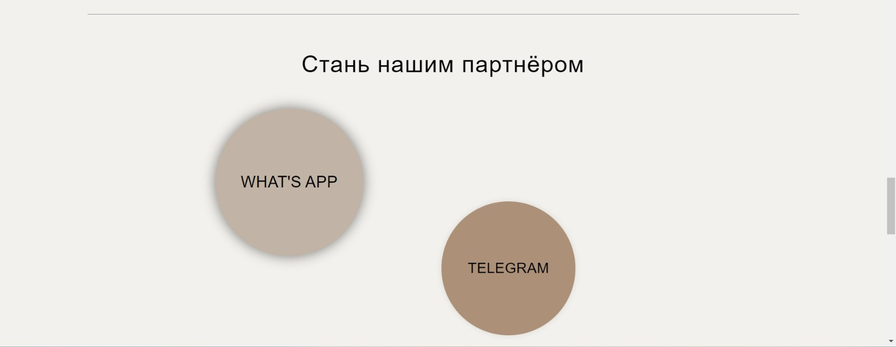
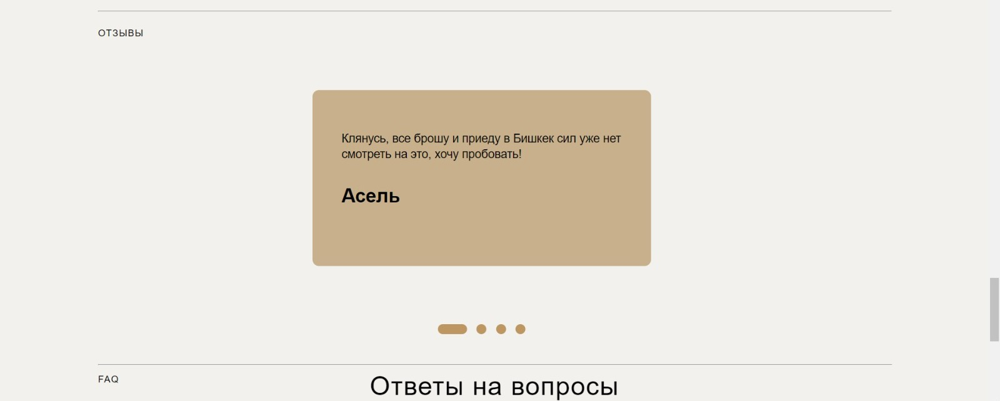
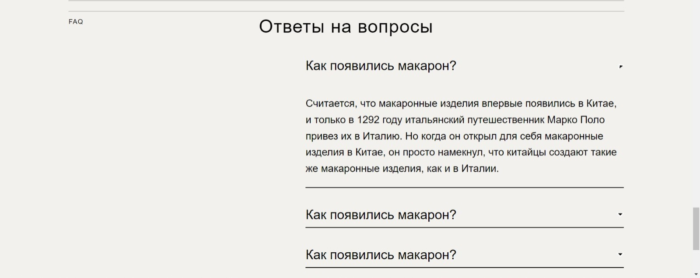
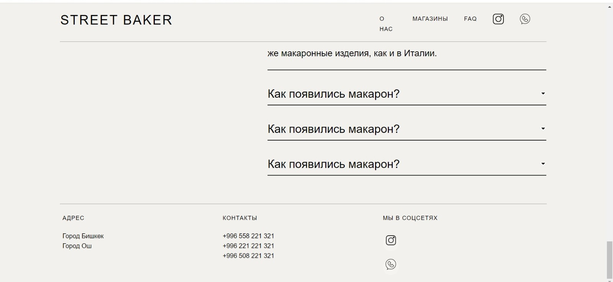

#Website for popular bakery, university project.
I did this project from scrach 
by myself with youtube videos. I did this project 2 years ago, but did not upload
becouse at that time did not understand git and github. I also understand
that it is not close to full website but i did my best to complete it.😊 
#Built With
Html 
Css
Figma

#Mock up
<a href="https://www.figma.com/file/KVAmHotHYcC0witlFBIN5L/Untitled?type=design&node-id=1%3A2&mode=design&t=xeWp4wEzzAstgIKc-1"
#Result
</img>
</img>
</img>
</img>
</img>
</img>
</img>
